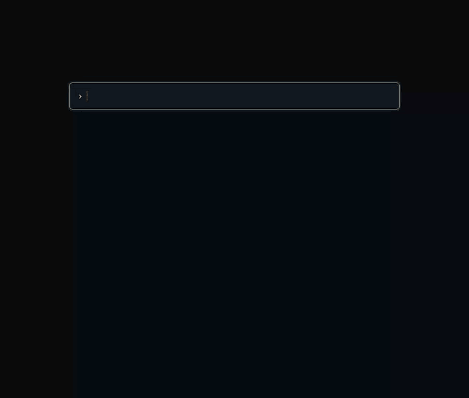

# Cram

**Turn any document into a self-graded flashcard quiz — no server, no accounts, just one HTML file.**

Cram turns pasted, attached, local, or web material into a validated deck and
a self-contained, offline flashcard quiz in a single HTML file you can open in
any browser.



The generated player supports:

- basic, multiple-choice (MCQ), and cloze cards;
- self-grading with a score and review screen;
- retrying only the cards you missed;
- optional hints and explanations; and
- progress persisted in the browser, so you can come back to a deck later.

## Try the demo

**[Open the live demo →](https://sjquant.github.io/cram/examples/http-caching-essentials.html)**
— no install, nothing to clone, it just runs in your browser.

The repository also includes the deck that generated it: browse the [deck
source](examples/http-caching-essentials.json), or open the [rendered HTML
file](examples/http-caching-essentials.html) directly from a local clone.

## Install in Claude Code

Add the Cram marketplace, then install its `cram` plugin:

```text
/plugin marketplace add sjquant/cram
/plugin install cram@cram
```

The first command registers the GitHub marketplace (`sjquant/cram`). The
second follows Claude Code's `plugin-name@marketplace-name` convention; both
names are `cram` here. After installation, invoke the skill as `/cram:cram` or
ask Claude Code to make flashcards or an interactive quiz from your material.

For the complete extraction, deck-format, and rendering workflow, see the
[skill guide](skills/cram/SKILL.md).

## Use with other AI tools

The skill payload follows the portable [Agent Plugins](https://agent-plugins.org/)
format and lives in `skills/cram/`. The [`npx skills`](https://github.com/vercel-labs/skills)
installer can place it in any supported agent's skill directory (using a
symlink by default, or copies when requested):

```sh
npx skills add sjquant/cram --skill cram
```

To target agents explicitly, repeat `--agent`, for example:

```sh
npx skills add sjquant/cram --skill cram \
  --agent codex \
  --agent cursor \
  --agent github-copilot \
  --agent grok \
  --agent kiro-cli \
  --agent antigravity-cli
```

This repository also includes native marketplace metadata where the format is
documented: Claude Code (`.claude-plugin/`), Codex (`.codex-plugin/` and
`.agents/plugins/`), Cursor (`.cursor-plugin/`), and GitHub Copilot
(`.github/plugin/`). Codex and Copilot can be installed from their respective
marketplace catalogs:

```text
codex plugin marketplace add sjquant/cram
codex plugin add cram@cram

copilot plugin marketplace add sjquant/cram
copilot plugin install cram@cram
```

Kiro Powers and Cursor's public marketplace require their own import or
review/publish flow; Antigravity and Grok can use the portable skill, and Grok
also reads Claude-compatible plugin marketplaces.

## Player language

Choose the player UI language when rendering a deck:

```sh
python3 skills/cram/scripts/render.py deck.json -o quiz.html --language ko
```

`--lang` is an alias for `--language`. Supported codes are `en` (English,
the default), `ko` (Korean), `ja` (Japanese), `zh-CN` (Simplified Chinese),
`es` (Spanish), and `fr` (French). Unsupported codes produce an error before
the output is written. Buttons, settings, feedback, and accessibility labels
use the selected language; deck content retains its original text. CLI help
and diagnostics are in English. All translations needed by the player are
embedded in the HTML, so playback remains offline.

To add a translation, copy `skills/cram/locales/en.json` to a new language
file and translate its values, keeping every English message key and named
placeholder (such as `{count}`). Plural messages use language-specific
categories selected by `Intl.PluralRules` and require an `other` form.
Register the code in the renderer's `LANGUAGES`, add a browser integration
case, and update the supported codes here and in the skill guide. The renderer
rejects incomplete catalogs, malformed values, and mismatched placeholders.
It also checks that marked HTML messages and JavaScript translation calls
exist in the English catalog, so omissions from all catalogs fail before
output is written. Mark static text-only elements with `data-i18n` and
attributes with `data-i18n-attrs="aria-label title"`. In JavaScript, pass
literal, double-quoted message keys to `t(...)`, with variables supplied as
parameters rather than embedded in the key. Add each new message to every
catalog.

The template is a rendering input. To preview a change, generate an HTML
file using the command above, or refresh the committed example:

```sh
python3 skills/cram/scripts/render.py examples/http-caching-essentials.json \
  -o examples/http-caching-essentials.html
```

Open the generated HTML in a browser. Preview and production rendering both
use the locale JSON files, including English plural forms. Preserve each
of the template's three injection tokens exactly once; surrounding HTML
and script formatting can change freely.

## Requirements

For skill users, system `python3` is enough—there is nothing to install with
`pip`, and no Node.js, Playwright, Chromium, server, or network connection is
needed to play a rendered deck. The output is a single HTML file containing
the player and deck data.

The optional Playwright browser suite is for repository contributors and CI
only. It requires the JavaScript development dependencies and Chromium
described in [`tests/README.md`](tests/README.md); skill users never need
those dependencies.

## License

[MIT](LICENSE)
